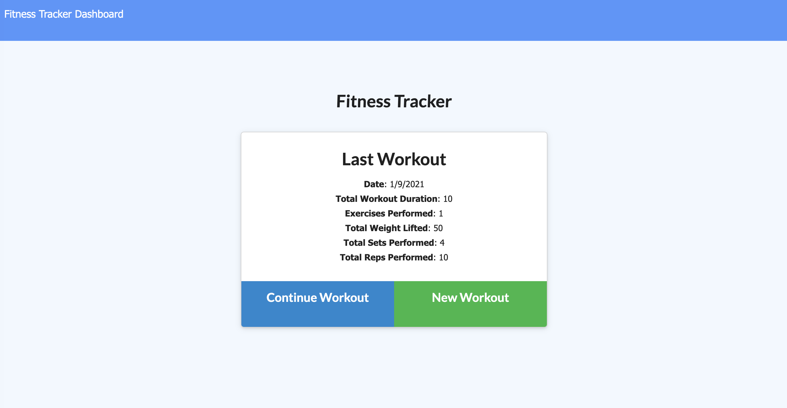
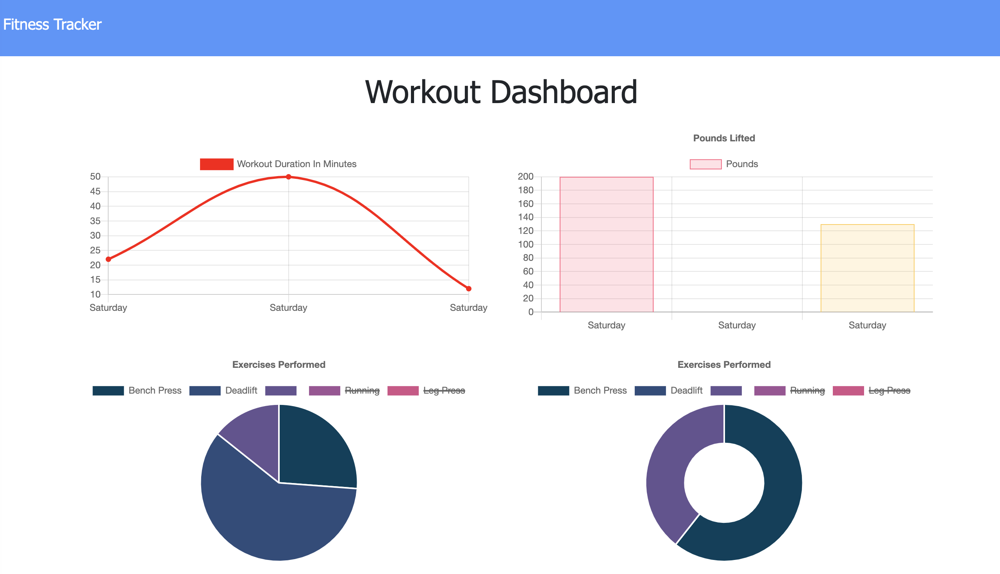

# Fitness Tracker

\*[Description](#Description)

\*[Installation](#Installation)

\*[Usage](#Usage)

\*[Contributing](#Contributing)

\*[Testing](#Testing)

\*[License](#License)

## Description

This project incorporates creating a Mongo database with a Mongoose schema. The routes for this application are handled by using Express. The following is accomplished with this application:

- A user can view, create, and track daily workouts

- Multiple exercises can be logged on a given day

- The name, type, weight, sets, reps, and duration can be tracked

- If the exercise is cardio, the distance traveled can be tracked

- A user can view the combined weight of multiple exercises from the past seven workouts on the `stats` page.

- A user can view the total duration of each workout from the past seven workouts on the `stats` page.

To view the final application demo, please use this link:

- https://fitness-tracker-843.herokuapp.com/

# Installation

The code for the Fitness Tracker can be found on github using the following link:

- https://github.com/shelbyandersen/fitness-tracker

# Usage

The Fitness Tracker uses node.js, Express, and MongoDB to create and store data for the application.

The database schema contains information for (example):

- type: "resistance",
- name: "Bicep Curl",
- duration: 20,
- weight: 100,
- reps: 10,
- sets: 4

# Contributing

The initial design of this application was provided by Trilogy Educational Services.

The application backend was completed by Shelby Andersen

# Testing

To test this application you will need to fork the repo here:

- https://github.com/shelbyandersen/fitness-tracker

You will need to `npm install` to install the required packages, you will also need to run Mongo and start the server with `node server.js`

# License

MIT License

Copyright (c) [2020] [Shelby Andersen]

Permission is hereby granted, free of charge, to any person obtaining a copy of this software and associated documentation files (the "Software"), to deal in the Software without restriction, including without limitation the rights to use, copy, modify, merge, publish, distribute, sublicense, and/or sell copies of the Software, and to permit persons to whom the Software is furnished to do so, subject to the following conditions: The above copyright notice and this permission notice shall be included in all copies or substantial portions of the Software.

THE SOFTWARE IS PROVIDED "AS IS", WITHOUT WARRANTY OF ANY KIND, EXPRESS OR IMPLIED, INCLUDING BUT NOT LIMITED TO THE WARRANTIES OF MERCHANTABILITY, FITNESS FOR A PARTICULAR PURPOSE AND NONINFRINGEMENT. IN NO EVENT SHALL THE AUTHORS OR COPYRIGHT HOLDERS BE LIABLE FOR ANY CLAIM, DAMAGES OR OTHER LIABILITY, WHETHER IN AN ACTION OF CONTRACT, TORT OR OTHERWISE, ARISING FROM, OUT OF OR IN CONNECTION WITH THE SOFTWARE OR THE USE OR OTHER DEALINGS IN THE SOFTWARE.

© 2020 Shelby Andersen in Collaboration with Georgia Tech Coding Boot Camp. All Rights Reserved.
